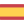

<h1>Suru++ Folders</h1>

Choose your language to read the documentation and tutorial:

 [Deutsch](languages/de.md)  
 [English](languages/en.md)  
 [Español](languages/es.md)  
 [Français](languages/fr.md)  
 [Italiano](languages/it.md)  
 [Nederlands](languages/nl.md)  
 [Português brasileiro](languages/pt_BR.md)  
 [Português europeu](languages/pt_PT.md)  

Soon:

 [Català](languages/ca.md)  
 [Eusaka](languages/eu.md)  
 [Română](languages/ro.md)  
 [Ελληνικάς](languages/el.md)  
 [עברית](languages/he.md)  
 [ქართული](languages/ka.md)  
 [Русский](languages/ru.md)  
 [Українська](languages/ru.md)  
 [日本語](languages/ja.md)  
